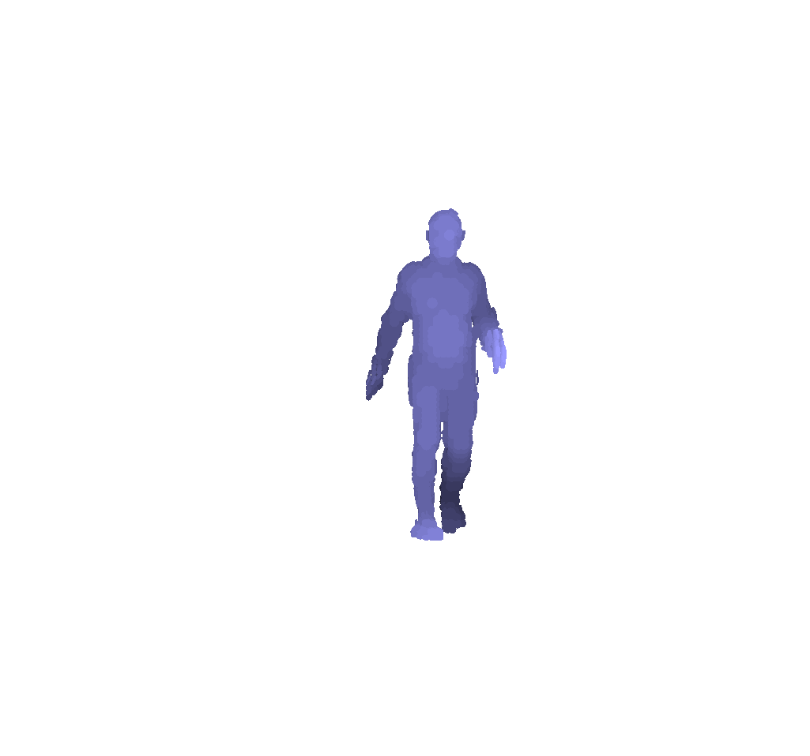
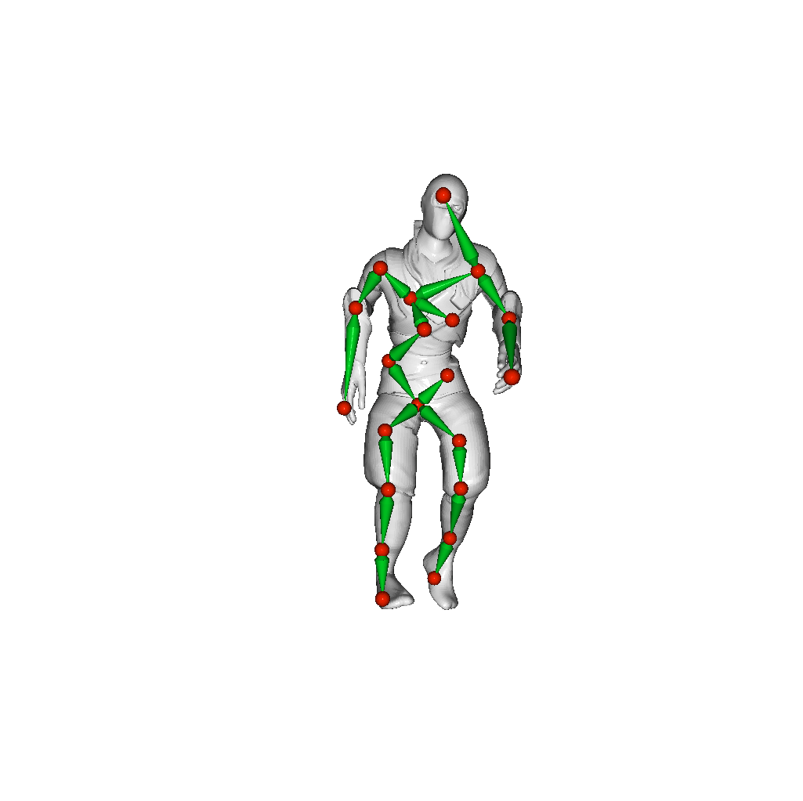

# Neural Marionette

## Introduction
This is an official pytorch code for the paper, Neural Marionette: Unsupervised Learning of Motion Skeleton and Latent Dynamics for Volumetric Video (AAAI 2022, Oral).[arxiv](https://arxiv.org/abs/2202.08418)

This work is to extract skeletal structure from volumetric observations and to learn motion dynamics from the detected skeletal motions in a fully unsupervised manner.

Our model conducts <strong>motion generation/interpolation/retargeting</strong> based on the learned latent dynamics.

## Install
We tested on Python 3.8 and Ubuntu 18.04 LTS.

The architecture is built from Pytorch 1.7.1 with Cuda 11.0.

Creating a conda environment is recommended.

```shell
## Download the repository
git clone https://github.com/jinseokbae/neural_marionette.git
cd neural_marionette
## Create conda env
conda create --name nmario python=3.8
conda activate nmario
## modify setup.sh to match your cuda setting
bash setup.sh
```

## Dataset
We tested Neural Marionette with the various dataset.
- [AIST++](https://github.com/google/aistplusplus_api)
- [D-FAUST](https://dfaust.is.tue.mpg.de/)
- [Animals](https://github.com/rabbityl/DeformingThings4D)
- [Hands](https://lmb.informatik.uni-freiburg.de/resources/datasets/HanCo.en.html)
- [Robot](https://github.com/CoppeliaRobotics/CoppeliaSimLib)

Basically our model requires a raw point cloud sequence, which means no preprocessing is required.
We provide train/test split information for AIST++, D-FAUST, Animals dataset on the ```dataset/```.

## Training
Once dataset is ready, you can train model according to pre-defined hyperparameters in ```dataset/config.py```.

```shell
## run training code
python train.py --exp_name 'experiment_name' --dataset 'aist'
```

## Demo
Using provided pretrained model, run demo codes to visualize followings:
```shell
## Motion generation
python vis_generation.py
## Result will be stored in output/demo/generation
```


```shell
## Motion interpolation
python vis_interpolation.py
## Result will be stored in output/demo/interpolation
```


```shell
## Motion retargeting
python vis_retarget.py
## Result will be stored in output/demo/retarget
```


## Citation

If our code is helpful for your research, please cite our paper:

```
@inproceedings{Bae2022NMARIO,
  author = {Jinseok Bae, Hojun Jang, Cheol-Hui Min, Hyungun Choi, and Young Min Kim},
  title = {Neural Marionette: Unsupervised Learning of Motion Skeleton and Latent Dynamics from Volumetric Video},
  booktitle = {Proceedings of the 36th AAAI Conference on Artificial Intelligence (AAAI 2022)},
  month = {February},
  year = {2022}
}
```
